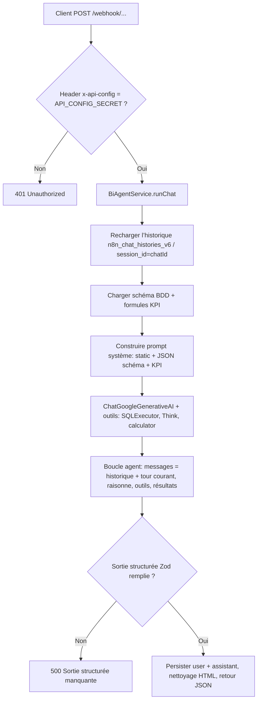
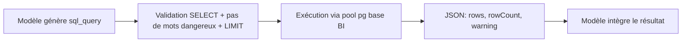

# Agent IA BI — Fonctionnalités et processus

Ce document décrit l’**agent d’analyse BI** du backend (`ia_back`) : génération et exécution SQL, outils, sortie structurée et point d’entrée API. Il s’inspire d’un **flux n8n** équivalent (webhook, agent avec outils, sortie structurée).

---

## 1. Rôle de l’agent

L’agent est un **assistant analytics / KPI** orienté **données réelles** (solaire, production, carburant). Il :

- s’appuie sur le **schéma PostgreSQL** des tables autorisées (injection côté serveur dans le prompt système) ;
- **génère des requêtes SQL** en lecture seule, les **exécute** via un outil dédié, et itère en cas d’erreur (dans la limite du raisonnement du modèle) ;
- produit une **réponse HTML** (thème sombre, tableaux, éventuels graphiques Chart.js) et des champs de **traçabilité** (résultats SQL, formules, dernière requête) ;
- suit des **règles métier** (solaire, carburant) et des **formules KPI** documentées en annexe de prompt.

Le modèle utilisé est **Google Gemini** via `@langchain/google-genai` (`ChatGoogleGenerativeAI`). Le modèle par défaut est paramétrable par la variable d’environnement `GEMINI_MODEL`.

---

## 2. Données et schéma

Le service `SchemaService` interroge `information_schema` sur la **base analytique** (connexion configurée en base via l’admin `Base BI`, ou `DATABASE_URL` si vide) et reconstruit un objet **JSON de schéma** (équivalent « Info BDD » n8n) pour les tables BI configurées en base **uniquement** — par défaut :

| Table                 | Rôle (résumé)                                    |
|-----------------------|--------------------------------------------------|
| `puissance_installee` | Capacité par site (clé `site_name`, etc.)        |
| `irradiance`          | Mesures d’irradiance, températures, horodatage   |
| `production`          | Production électrique, tensions, courants, etc.  |
| `vente_carburant`     | Volumes de carburant par date / station / produit |

Les colonnes sont enrichies (types, nullabilité, clés primaires, clés étrangères) pour guider l’LLM.

---

## 3. Outils (tools) exposés à l’agent

Trois outils LangChain sont assemblés dans `buildBiTools` :

| Outil         | Rôle |
|---------------|------|
| **SQLExecutor** | Exécute une requête `sql_query` sur PostgreSQL. Le backend impose une **sélection en lecture seule** (voir section suivante) et un **plafond de résultat** (voir ci-dessous). Le résultat (lignes, nombre de lignes, avertissements) est renvoyé en JSON texte à l’agent. |
| **Think**     | Aide le modèle à **structurer** son raisonnement (notes courtes) ; ne modifie pas la base. |
| **calculator** | Évalue une **expression arithmétique** restreinte (`+ - * /` et parenthèses, caractères dangereux filtrés, longueur plafonnée). |

Ainsi, l’**agent ne parle pas directement** au pool de la base BI : toute requête passe par l’outil **SQLExecutor**, qui applique des garde-fous côté serveur.

---

## 4. Génération SQL et sécurité

- **Côté prompt** (fichier `static.txt`) : l’agent est invité à n’écrire que des `SELECT` (éventuellement `WITH ... SELECT`), à préfixer par `public.`, à limiter le volume (`LIMIT 500`), et à éviter certains patterns dynamiques de dates (détails dans le prompt).
- **Côté code** (`ensureSelectReadOnly` dans `bi-tools.ts`) :
  - seules les requêtes commençant par `WITH` ou `SELECT` sont acceptées ;
  - des mots-clés d’écriture / DDL (`INSERT`, `UPDATE`, `DELETE`, `DROP`, etc.) provoquent un **rejet** ;
  - si la requête n’a pas de `LIMIT` explicite, **`LIMIT 500` est ajouté** automatiquement, avec un message d’avertissement pour l’agent.

La génération SQL est donc **une capacité de l’LLM** contrôlée par le prompt **et** par l’exécution d’outils.

---

## 5. Sortie structurée (schéma Zod)

Le graphe d’agent (`createReactAgent` de LangGraph) est configuré avec un **`responseFormat`** basé sur `bi-output.schema` (Zod) :

| Champ         | Contenu attendu (métadonnées) |
|---------------|------------------------------|
| `html`        | Contenu **HTML** pour l’utilisateur (réponse riche) |
| `resultatSQL` | Résumé ou chiffres issus de l’exécution SQL |
| `formuleKPI`  | Formules KPI mobilisées |
| `dataKPI`     | Données associées aux KPI |
| `requeteSQL`  | Dernière requête SQL pertinente |

Le service renvoie en plus un champ **`output`** : copie de `html` nettoyée (suppression éventuelle de fences ```html).

Si la sortie structurée est **absente**, le backend renvoie une erreur serveur (pas de contenu tronqué silencieux).

---

## 6. Règles métier et formules (prompts)

- **`static.txt`** : identité BI, règles solaire (puissance installée, irradiance, production « brute » en excluant notamment `puissance_active <= 0` quand c’est requis), interdiction d’inventer des entités, workflow analyse / requêtes, format HTML, rappel des champs structurés finaux.
- **`formule-kpi.txt`** (injecté via `__KPI_BLOCK__`) : formules d’**irradiation par heure / jour**, d’**énergie** produite, de **PR (Performance Ratio)**, et agrégation **carburant** (volumes sur période).

Ces blocs complètent le **bloc de schéma** (`__SCHEMA_BLOCK__` : JSON BDD) dans le **message système** unique de l’agent.

---

## 7. API HTTP (webhook)

- **Méthode** : `POST`
- **Chemin** : `/webhook/5a2715bd-0b56-4e05-9c24-eb48e13c5d7a` (identique à l’URL de webhook n8n d’origine)
- **Authentification** : en-tête `x-api-config` obligatoire, à comparer à la variable d’environnement `API_CONFIG_SECRET` (même rôle qu’un jeton côté n8n)
- **Corps JSON** (champs validés) : `message` (requis), `chatId` (requis), `userId` (requis) ; optionnellement `dataContext`, `history`  
  *Note : `userId` et les champs optionnels ne sont aujourd’hui pas consommés par `runChat` (seulement `message` et `chatId`), mais l’API reste alignée sur le DTO n8n.*

**Santé** : `GET /` sur l’app Nest renvoie le message d’accueil standard (hors portée de l’agent).

---

## 8. Processus de bout en bout (synthèse)

Le schéma ci-dessous résume l’enchaînement côté serveur pour **une requête utilisateur** :



À l’**intérieur** de l’appel d’outils SQL, le flux est :



**Limite de profondeur** : l’appel `agent.invoke` utilise `recursionLimit: 40` (nombre d’étapes de graphe, dont les appels d’outils).

---

## 9. Configuration d’environnement (rappel)

| Variable            | Rôle |
|---------------------|------|
| `DATABASE_URL`      | Base **application** (IAM, rôles, conversations, `n8n_chat_histories_v6`) |
| `GOOGLE_API_KEY`    | Clé API Google (Gemini) |
| `GEMINI_MODEL`      | Nom du modèle (ex. `gemini-3-flash-preview`) |
| `API_CONFIG_SECRET` | Secret partagé pour l’en-tête `x-api-config` sur le webhook |
| `PORT`              | Port d’écoute du serveur (défaut 3000) |
| `CHAT_HISTORY_MAX_MESSAGES` | Nombre max de **messages** (lignes user/assistant) déjà enregistrés à recharger via `n8n_chat_histories_v6` pour le même `session_id` (`chatId`) — ex. 3 ou 4 (défaut 4) |

**Persistance** : table `n8n_chat_histories_v6` (`session_id`, `message` jsonb `{"role","text"}`) ; après chaque réponse, enregistrement du tour user + texte d’aide-mémoire assistant (`resultatSQL` ou HTML dépouillé).

---

## 10. Limites opérationnelles

- **Quota / 429** : des erreurs *Too Many Requests* côté Google peuvent survenir ; ce n’est pas un défaut d’intégration application en soi, mais un plafond côté fournisseur.
- **Tables couvertes** : seules les tables BI configurées en base via l’admin sont exposées ; toute autre table est invisible pour l’agent.
- **Histoire côté client** : le DTO peut encore comporter un champ `history` — la **référence** d’historique est celle lue en base sur `chatId` (session), pas l’ancien `history` du client.

---

*Document généré à partir du code source de `ia_back` (services BI, outils, prompts, contrôleur webhook).*
